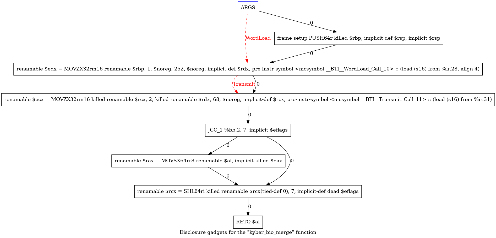

# PROJECT NOT UNDER ACTIVE MANAGEMENT #  
This project will no longer be maintained by Intel.  
Intel has ceased development and contributions including, but not limited to, maintenance, bug fixes, new releases, or updates, to this project.  
Intel no longer accepts patches to this project.  
 If you have an ongoing need to use this project, are interested in independently developing it, or would like to maintain patches for the open source software community, please create your own fork of this project.  
  
# Branch-Target-Injection-Gadget-Finder
```
No license (express or implied, by estoppel or otherwise) to any intellectual
property rights is granted by this document, with the sole exception that a)
you may publish an unmodified copy and b) code included in this document is
licensed subject to the Zero-Clause BSD open source license (0BSD),
https://opensource.org/licenses/0BSD.  You may create software implementations
based on this document and in compliance with the foregoing that are intended
to execute on the Intel product(s) referenced in this document. 

Intel technologies may require enabled hardware, software or service
activation.

No product or component can be absolutely secure. 

Your costs and results may vary. 

© Intel Corporation.  Intel, the Intel logo, and other Intel marks are
trademarks of Intel Corporation or its subsidiaries.  Other names and brands
may be claimed as the property of others.   
```

## Overview
The intent and behavior of this tool are described in this
[blog post](https://www.intel.com/content/www/us/en/developer/articles/news/update-to-research-on-disclosure-gadgets-in-linux.html).

## Build and Install
Refer to [existing directions](https://llvm.org/docs/GettingStarted.html) to
set up LLVM. Ensure that the `X86` target is included in the
`LLVM_TARGETS_TO_BUILD` CMake variable, and ensure that `clang` and `lld` are
included in `LLVM_ENABLE_PROJECTS`. Then within the top-level `llvm-project`
directory, run the following commands:
```
$ git checkout 5c68a1cb123161b54b72ce90e7975d95a8eaf2a4 # the llvmorg-15.0.4 tag
$ git apply <path-to-Branch-Target-Injection-Gadget-Finder>/bti-gadget-finder-llvmorg-13.0.0.patch
```
and then build (or rebuild) LLVM, and optionally install (or reinstall) LLVM.

## Scanning the Linux kernel
Within the Linux kernel top-level directory, run the following commands to
configure the kernel for a link-time optimization (LTO) build:
```
$ make LLVM=1 LLVM_IAS=1 CC=<path-to-llvm>/build/bin/clang defconfig
$ scripts/config -e LTO_CLANG_THIN
```
And then to build and scan:
```
$ make LLVM=1 LLVM_IAS=1 CC=<path-to-llvm>/build/bin/clang \
    HOSTCC=<path-to-llvm>/build/bin/clang \
    LD=<path-to-llvm>/build/bin/ld.lld \
    KBUILD_LDFLAGS="-mllvm -x86-bti-gadget-finder -mllvm -stats -mllvm -x86-bti-symbols"
```
This command will scan the kernel for linear disclosure gadgets, print summary
statistics, and emit symbols (prefixed with `__BTI__`) into the kernel binary 
to indicate components of a gadget. For example:
```
$ objdump -d vmlinux -M intel
...
ffffffff8149cfd0 <hctx_type_show>:
ffffffff8149cfd0:       0f b7 87 fc 00 00 00    movzx  eax,WORD PTR [rdi+0xfc]
ffffffff8149cfd7 <__BTI__Transmit_Call_17>:
ffffffff8149cfd7:       48 8b 14 c5 50 85 42    mov    rdx,QWORD PTR [rax*8-0x7dbd7ab0]
ffffffff8149cfde:       82
ffffffff8149cfdf:       48 89 f7                mov    rdi,rsi
ffffffff8149cfe2:       48 c7 c6 58 b4 3c 82    mov    rsi,0xffffffff823cb458
ffffffff8149cfe9:       31 c0                   xor    eax,eax
ffffffff8149cfeb:       e8 10 9c de ff          call   ffffffff81286c00 <seq_printf>
ffffffff8149cff0:       31 c0                   xor    eax,eax
ffffffff8149cff2:       c3                      ret
...
```
The tool can also print graph representations of disclosure gadgets when the
`--x86-bti-dot` option is provided (`-mllvm -x86-bti-dot` when using `clang`).
The tool creates a `*.dot` file for each function in which one or more
disclosure gadgets was found. These files can be converted into image files:
```
$ ls *.dot | xargs dot -Tpng -O
```
For example, the following graph depicts a disclosure gadget where a function
argument influences the address of a zero-extended word load (`MOVZX`), whose
result then propagates to a cache covert channel transmitter (another `MOVZX`):


**Note**: The analysis in the
[blog post](https://www.intel.com/content/www/us/en/developer/articles/news/update-to-research-on-disclosure-gadgets-in-linux.html)
was conducted on Linux v5.16.5, commit
8ab774587903771821b59471cc723bba6d893942, with the Makefile patch included in
this repository. For example:
```
$ cd linux
$ git checkout 8ab774587903771821b59471cc723bba6d893942
$ git apply <path-to-Branch-Target-Injection-Gadget-Finder>/linux-makefile-v5.16-5.patch
$ make clean
$ make LLVM=1 LLVM_IAS=1 CC=<path-to-llvm>/build/bin/clang defconfig
$ scripts/config -e LTO_CLANG_THIN
$ make LLVM=1 LLVM_IAS=1 CC=<path-to-llvm>/build/bin/clang \
    HOSTCC=<path-to-llvm>/build/bin/clang \
    LD=<path-to-llvm>/build/bin/ld.lld
```

## Command-line Options Reference
```
--x86-bti-dot                    - For each function, emit a dot graph
                                   depicting potential BTI gadgets
--x86-bti-gadget-finder          - Enable scanning for BTI disclosure gadgets
--x86-bti-gadget-type=<string>   - The type of disclosure gadget for which to
                                   scan [default=masked]:
                                     masked   Only gadgets where the access is zero/sign extended
                                     linear   Only masked gadgets that do not cross a call or Jcc
                                     all      All reachable gadgets that load and transmit a value
--x86-bti-symbols                - Emit gadget component symbols into the binary
--x86-bti-target=<string>        - Specify types of indirect branch targets to
                                   analyze [default=call]:
                                     call     indicates indirect call targets
                                     jmp      indicates indirect jump targets
                                     ret      indicates return targets
                                     all      indicates all indirect branch targets
```

<!-- First Review - 10/31/23 - MRB -->
